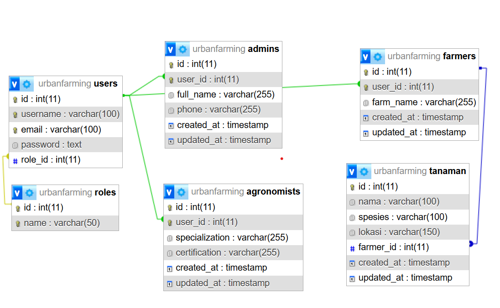

# Urban Farming Management System
 
## Instruksi Install dan Run

### 1. Clone Repository
```bash
git clone https://github.com/salsabilmaheswari/tes-skill.git
cd tes-skill
```

### 2. Setup Database (MySQL)
1. Buat database baru di MySQL:
```sql
CREATE DATABASE urbanfarming;
```
2. Lalu import file SQL (urbanfarming.sql)
* Jika menggunakan phpMyAdmin, pilih database **urbanfarming** yang sebelumnya sudah dibuat → menu Import → pilih file urbanfarming.sql
* Jika menggunakan command line, jalankan:
```
mysql -u root -p urbanfarming < urbanfarming.sql
```

### 3. Setup Backend
```bash
cd backend
npm install
```

1. Buka file `.env` di folder `backend/`
```env
PORT=4000
DB_HOST=localhost
DB_USER=root
DB_PASSWORD=yourpassword
DB_DATABASE=urbanfarming
JWT_SECRET=yourjwtsecret
```
* Sesuaikan dengan user dan password MySQL
* Isi JWT_SECRET dengan secret string bebas 
* Jangan gunakan nilai default yourpassword dan yourjwtsecret di production. Ganti dengan nilai sebenarnya di server masing-masing.

2. Seed Admin Default
Untuk membuat akun admin default, jalankan:
```bash
node seedAdmin.js
```
Default akun admin:

* Email: `admin@example.com`
* Password: `Admin123!`

### 4. Setup Frontend
Masuk ke folder frontend:

```bash
cd ../frontend
npm install
```
Jalankan frontend:
```bash
npm run start
```

## Struktur Database


## Teknologi dan library utama

### Backend
* Express.js
* MySQL
* Sequelize
* JWT (jsonwebtoken)
* bcryptjs

### Frontend

* React
* Vite
* TypeScript
* Axios
* React Router DOM
* Lucide React